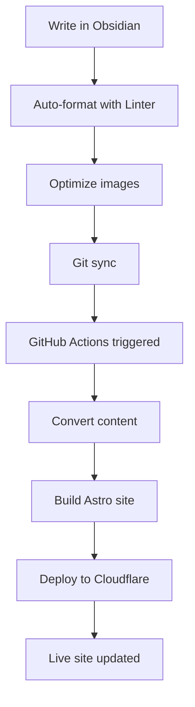

# 📋 Obsidian Integration & Deployment

This site is designed to be managed as an Obsidian vault with automated deployment to Cloudflare Pages.

## Overview

Write content in Obsidian with full plugin support, then automatically convert and deploy via GitHub Actions. This provides the best of both worlds: Obsidian's powerful writing environment and Astro's static site generation.

## Obsidian Configuration

The repository includes an `.obsidian/` folder with recommended plugins and settings.

### Community Plugins

The following plugins are configured for optimal workflow:

#### obsidian-git

- **Purpose**: Automatic commits and syncing with GitHub
- **Features**: Auto-commit on save, auto-pull, auto-push
- **Configuration**: Set commit interval and message format

#### obsidian-linter

- **Purpose**: Automatically formats and validates markdown
- **Features**: Auto-generates frontmatter, formats content
- **Benefits**: Ensures consistent frontmatter structure

#### obsidian-local-images-plus

- **Purpose**: Downloads and converts external images
- **Features**: Auto-converts to WebP, stores in `src/assets/`
- **Benefits**: Optimized images, local storage

#### obsidian-metadata-links

- **Purpose**: Manages frontmatter and metadata
- **Features**: Auto-update links, maintain metadata
- **Benefits**: Keeps frontmatter consistent

#### file-explorer-plus

- **Purpose**: Enhanced file organization
- **Features**: Better file management, sorting
- **Benefits**: Easier content organization

### Plugin Benefits

1. **Automatic Frontmatter**: Linter auto-generates required fields
2. **Image Optimization**: Local Images Plus converts to WebP
3. **Git Automation**: Obsidian Git handles commits/pushes
4. **Content Validation**: Linter ensures markdown follows conventions

### Setup in Obsidian

1. **Open Vault**: Open this repository as an Obsidian vault
2. Obsidian plugins are presents in this repository in .obsidian folder.
3. **Install Plugins**: Install community plugins when prompted or manually enable in Settings → Community Plugins
4. **Configure Git**: Settings → Obsidian Git → Set credentials
5. **Adjust Linter**: Settings → Linter → Customize rules if needed

## Deployment Pipeline

Automated deployment via GitHub Actions when content changes.

### Architecture

- **Repository**: Single repo for content + code
- **Build Tool**: `obsidian-export` v22.11.0 converts markdown
- **Deployment**: Cloudflare Pages via Wrangler CLI
- **Schedule**: Auto-rebuild every 2 days at 9 AM UTC

### Workflow Triggers

```yaml
on:
  workflow_dispatch:           # Manual trigger
  push:
    branches: [main]
    paths:
      - "src/content/**"      # Auto-deploy on content changes
  schedule:
    - cron: "0 9 */2 * *"     # Every 2 days at 9 AM UTC
```

#### Why Scheduled Rebuilds?

Keeps dynamic content fresh:

- Last.fm current track updates
- Raindrop.io bookmarks sync
- Reading list updates
- Any API-driven content

### Pipeline Steps


1. **Checkout Repository**: Fetches latest code
2. **Prepare Content**: Copies `src/content/` and `public/assets/`
3. **Convert with obsidian-export**: Processes Obsidian markdown
4. **Replace Content**: Overwrites with converted files
5. **Build Site**: Builds Astro site (fetches API data)
6. **Deploy**: Pushes `dist/` to Cloudflare Pages

### Key Features

- ✅ **Concurrency Control**: Cancels in-progress builds on new push
- ✅ **Timeout Safety**: 15-minute timeout prevents hanging
- ✅ **Dependency Caching**: Caches Bun and obsidian-export
- ✅ **Environment Variables**: Secure API credentials via secrets
- ✅ **Build Summaries**: Success/failure notifications

## Required GitHub Secrets

Configure in: `Settings → Secrets and variables → Actions`

### Required Secrets

```env
CLOUDFLARE_API_TOKEN=your_cloudflare_api_token
CLOUDFLARE_ACCOUNT_ID=your_cloudflare_account_id
```

### Optional Secrets (for integrations)

```env
RAINDROP_ACCESS_TOKEN=your_raindrop_token
PUBLIC_LASTFM_API_KEY=your_lastfm_key
LASTFM_SHARED_SECRET=your_lastfm_secret
PUBLIC_GOATCOUNTER_CODE=your_analytics_code
```

### Getting Cloudflare Credentials

1. **API Token**:
   - Go to Cloudflare Dashboard → My Profile → API Tokens
   - Create Token → Use "Edit Cloudflare Workers" template
   - Select your account and Pages project
   - Copy token to GitHub secrets

2. **Account ID**:
   - Cloudflare Dashboard → Select your domain
   - Scroll down to "Account ID" on right sidebar
   - Copy to GitHub secrets

## Content Structure

```
src/content/
├── blog/              # Blog posts
│   └── my-post.md
├── wiki/              # Hierarchical wiki
│   └── development/
│       └── astro.md
├── projects/          # Project showcases
│   └── my-project.md
├── about.md           # About page
├── uses.md            # Uses page
├── now.md             # Now page
├── blogroll.md        # Blogroll
└── bookmarks/         # Placeholder (Raindrop-powered)

public/assets/         # Images referenced in content
└── images/
    └── photo.webp
```

**Note**: Images are moved to `src/assets/` during build for Astro optimization.

## Obsidian → Astro Conversion

`obsidian-export` handles these transformations:

### Wikilinks

```markdown
# Obsidian
[[note-title]]

# Converted
[note-title](./note-title.md)
```

### Image Paths

Preserves relative paths for Astro processing:

```markdown
# Obsidian
![[image.png]]

# Converted

```

### Frontmatter

Maintains YAML frontmatter structure:

```markdown
---
title: "Post Title"
date: 2025-11-02
published: true
---
```

### Nested Folders

Preserves folder hierarchy for wiki navigation.

## Local Testing

Test the conversion pipeline before deploying.

### Test Script

```bash
bun run obsidian:test
```

This will:

1. Create `obsidian_test/` directory
2. Copy content and assets
3. Run obsidian-export conversion
4. Show before/after comparison
5. Clean up temporary files

### Available Commands

```bash
bun run obsidian:test           # Run conversion test
bun run obsidian:clean          # Clean test directory
bun run obsidian:clean:export   # Remove obsidian-export binary
```

### Manual Testing

```bash
# 1. Install obsidian-export
curl -L https://github.com/zoni/obsidian-export/releases/download/v22.11.0/obsidian-export_Linux-x86_64.bin -o obsidian-export
chmod +x obsidian-export

# 2. Test conversion
./obsidian-export src/content obsidian_test/content

# 3. Compare
diff -r src/content obsidian_test/content

# 4. Clean up
rm -rf obsidian_test
```

## Cloudflare Pages Configuration

**Important**: Disable automatic Git deployments.

### Why Disable Auto-Deploy?

- GitHub Actions handles deployment
- Ensures content is converted properly
- Prevents duplicate builds
- Faster deployments

### Steps

1. Cloudflare Pages → Your project → Settings
2. Builds & deployments
3. **Disable** "Automatic deployments"
4. Keep "Production branch" set to `main`

This ensures only GitHub Actions triggers deploys.

## Deployment Workflow

Typical content update flow:



### Timeline

1. **Write**: Create/edit in Obsidian
2. **Auto-format**: Linter adds frontmatter
3. **Optimize**: Images converted to WebP
4. **Sync**: Obsidian Git commits and pushes
5. **Build**: GitHub Actions starts (~30s delay)
6. **Convert**: obsidian-export runs (~10s)
7. **Build**: Astro builds site (~60-90s)
8. **Deploy**: Cloudflare Pages deployment (~30s)
9. **Live**: Changes visible (~2-3 minutes total)

## Performance Optimizations

### Build Speed

- **~60% faster** with Bun dependency caching
- **Instant obsidian-export** with binary caching
- **Cancel-in-progress** prevents wasted builds
- **15-minute timeout** prevents hanging

### Cache Strategy

```yaml
# Bun dependencies
key: ${{ runner.os }}-bun-${{ hashFiles('**/bun.lockb') }}

# obsidian-export binary
key: obsidian-export-v22.11.0
```

### Scheduled Rebuilds

Rebuilds every 2 days to:

- Update Last.fm music data
- Sync Raindrop bookmarks
- Refresh dynamic content
- Keep site current

## Troubleshooting

### Build Failures

Check GitHub Actions logs:

1. **Actions tab** in GitHub repository
2. Click failed workflow
3. Expand failed step
4. Check error message

Common issues:

- Invalid frontmatter
- Missing environment variables
- obsidian-export conversion errors
- Astro build errors

### Image Issues

If images don't appear:

- Ensure images in `public/assets/` before build
- Verify paths are relative
- Check Astro build logs for optimization errors
- Local Images Plus properly configured

### Deployment Issues

If deployment fails:

- Verify Cloudflare API token hasn't expired
- Check account ID is correct
- Ensure automatic deployments are disabled
- Review Cloudflare Pages logs

### Cache Issues

Clear GitHub Actions cache:

1. Actions → Caches
2. Delete all cache entries
3. Re-run workflow

### Testing Locally

```bash
# Build production locally
bun run build

# Preview
bun run preview

# Check for errors
# - Browse to http://localhost:4321
# - Check all pages load
# - Verify images appear
# - Test integrations
```

## Migration Notes

### Single Repository Approach

This project uses one repository for content + code.

**Benefits**:
- Simpler setup
- Single source of truth
- Easier deployment
- One repository to manage

**Alternative**: Separate repositories for content and code (not implemented).

### From Two-Repo Setup

If migrating from separate repos:

1. Move content from vault repo to `src/content/`
2. Update workflow to use single repo
3. Merge git histories if needed
4. Update Cloudflare Pages source

## Best Practices

### Writing in Obsidian

1. **Use templates**: Create frontmatter templates
2. **Organize with folders**: Use wiki hierarchy
3. **Tag consistently**: Reuse existing tags
4. **Local images**: Let plugin handle optimization
5. **Preview before commit**: Check in Obsidian preview

### Git Workflow

1. **Meaningful commits**: Let Obsidian Git handle auto-commits
2. **Pull before writing**: Avoid conflicts
3. **Regular syncs**: Don't wait too long between pushes
4. **Check builds**: Verify successful deployment

### Content Organization

1. **Clear structure**: Organize by collection
2. **Consistent naming**: Use kebab-case
3. **Frontmatter complete**: All required fields
4. **Published status**: Use drafts liberally

### Deployment

1. **Test locally first**: Run `bun run build`
2. **Check Actions logs**: Monitor builds
3. **Verify live site**: Check changes deployed
4. **Monitor errors**: Address failures promptly

## Benefits

✅ **Obsidian Native**: Write with full Obsidian features  
✅ **Automatic Deployment**: Push → auto-convert → live  
✅ **Version Control**: Full git history  
✅ **Automated Formatting**: Linter handles frontmatter  
✅ **Image Optimization**: Auto-convert to WebP  
✅ **Fast Builds**: Caching reduces build time  
✅ **Scheduled Rebuilds**: Dynamic content stays fresh  

## Related Documentation

- [Content Management](./04-content-management.md)
- [Deployment](13-deployment.md)
- [Integrations](./06-integrations.md)

## External Resources

- [Obsidian](https://obsidian.md)
- [obsidian-export](https://github.com/zoni/obsidian-export)
- [GitHub Actions](https://docs.github.com/en/actions)
- [Cloudflare Pages](https://pages.cloudflare.com)
